# CareerHarness — Code Knowledge Graph (Graphify Spec)

**Repository:** `CareerHarness`  
**Version:** 1.0.0  
**Generated At:** 2026-09-22  
**Architecture:** Multi-Tenant Modular Monolith with BYOK Envelope Encryption & DeepSeek-Adapted Harness  

---

## 1. High-Level Architectural Graph

```mermaid
graph TD
    subgraph ClientLayer ["Client & Interaction Layer"]
        CLI["CLI / Web Dashboard"]
        REST["FastAPI REST Endpoints\n(app.api.main)"]
        CLI -->|HTTP JSON / X-Tenant-ID| REST
    end

    subgraph ApiLayer ["API Router Subsystem (app.api.routers.*)"]
        R_KEYS["keys.py"]
        R_ROLES["roles.py"]
        R_RESUMES["resumes.py"]
        R_LINKEDIN["linkedin.py"]
        R_GAPS["gaps.py"]
        R_SCOUT["scout.py"]
        R_JOBS["jobs.py"]
        R_BATCHES["batches.py"]
        R_VAULT["vault.py"]
        R_APPS["applications.py"]
        R_TRACK["tracker.py"]
        R_INSIGHTS["insights.py"]
        R_RUNS["runs.py"]
        
        REST --> R_KEYS
        REST --> R_ROLES
        REST --> R_RESUMES
        REST --> R_LINKEDIN
        REST --> R_GAPS
        REST --> R_SCOUT
        REST --> R_JOBS
        REST --> R_BATCHES
        REST --> R_VAULT
        REST --> R_APPS
        REST --> R_TRACK
        REST --> R_INSIGHTS
        REST --> R_RUNS
    end

    subgraph DomainLayer ["Domain Engines (app.domain.*)"]
        D_MEM["memory.py\nBlackboard Context"]
        D_ROLES["roles.py\nRole Catalog F2"]
        D_RESUME["resume_parser.py\nHonesty Tagging F3"]
        D_LINKEDIN["linkedin.py\nConsent & Paste F4"]
        D_GAPS["gap_engine.py\nScore & Todos F5"]
        D_READINESS["readiness.py\nReadiness Gate F7"]
        D_EMAIL["email_connect.py\nMailbox Auth F6"]
        D_SCOUT["scout.py\nScout Scheduler F7"]
        D_JOBS["jobs.py\nAnalyst & Deduplication F8"]
        D_BATCHES["batches.py\nConcurrency & Fan-Out F8"]
        D_VAULT["vault.py\nImmutable Lineage F10"]
        D_APP_ENG["application_engine.py\n5-Stage Pipeline F9"]
        D_TRACK["tracker.py\nReply Classifier F11"]
        D_INSIGHTS["insights.py\nFunnel & Trusted Mode F12"]
    end

    subgraph HarnessLayer ["Thin Agent Harness (app.harness.*)"]
        H_LOOP["loop.py\nAgentLoop.step()"]
        H_REG["registry.py\nToolRegistry"]
        H_PIPE["pipeline.py\nGuardedToolPipeline"]
        H_SEAMS["seams.py\nAtsSeam & Providers"]
        H_PROJ["projections.py\nSessionEvent Projection"]
        H_TEAMS["teams.py\nTaskBoard & Mailbox"]
        H_CHECK["checkpointer.py\nPostgres State Snapshots"]
        H_GATE["gate.py\nHITL Gate Middleware"]
    end

    subgraph CoreLayer ["Core Security & Infrastructure (app.core.*)"]
        C_CONF["config.py\nPydantic Settings"]
        C_SEC["security.py\nLocalAESGCM & HKDF"]
        C_VAULT["keyvault.py\nBYOK Key Vault"]
        C_DB["database.py\nAsyncSession & RLS"]
        C_OUT["outbox.py\nTransactional Outbox"]
        C_ROUTER["model_router.py\nTier Model Dispatch\n(OpenRouter/DeepSeek Flash)"]
    end

    subgraph ModelsLayer ["Data Entities (app.domain.models.*)"]
        M_TENANT[("Tenant")]
        M_KEY[("ApiKey")]
        M_ROLE[("RoleCatalog / RoleSelection")]
        M_RES[("ResumeParse")]
        M_LI[("LinkedInProfile")]
        M_TODO[("TodoItem")]
        M_SCORE[("ReadinessScore")]
        M_CONSENT[("Consent")]
        M_MB[("ConnectedEmail")]
        M_SCHED[("ScoutSchedule")]
        M_JOB[("JobListing / JobMatch")]
        M_BATCH[("Batch / BatchItem")]
        M_DOC[("DocumentVersion")]
        M_AUDIT[("ApplicationAuditLog")]
        M_TRACK[("ApplicationTrack")]
        M_OUTREACH[("OutreachMessage")]
        M_INBOUND[("InboundEmail")]
        M_RUN[("Run / Checkpoint / Approval")]
        M_OUTBOX[("OutboxEvent")]
    end

    %% Bindings: API to Domain
    R_KEYS --> C_VAULT
    R_ROLES --> D_ROLES
    R_RESUMES --> D_RESUME
    R_LINKEDIN --> D_LINKEDIN
    R_GAPS --> D_GAPS
    R_GAPS --> D_READINESS
    R_SCOUT --> D_SCOUT
    R_JOBS --> D_JOBS
    R_BATCHES --> D_BATCHES
    R_VAULT --> D_VAULT
    R_APPS --> D_APP_ENG
    R_TRACK --> D_TRACK
    R_INSIGHTS --> D_INSIGHTS
    R_RUNS --> H_LOOP

    %% Bindings: Domain to Harness & Core
    D_APP_ENG --> H_SEAMS
    D_APP_ENG --> D_VAULT
    H_LOOP --> H_PIPE
    H_PIPE --> H_PROJ
    H_LOOP --> H_REG
    H_LOOP --> H_GATE
    H_LOOP --> H_CHECK
    H_LOOP --> C_VAULT
    H_LOOP --> C_ROUTER
    D_BATCHES --> H_TEAMS

    %% Bindings: Domain/Harness to Database
    C_DB --> M_TENANT
    C_VAULT --> M_KEY
    D_ROLES --> M_ROLE
    D_RESUME --> M_RES
    D_LINKEDIN --> M_LI
    D_GAPS --> M_TODO
    D_GAPS --> M_SCORE
    D_LINKEDIN --> M_CONSENT
    D_EMAIL --> M_MB
    D_SCOUT --> M_SCHED
    D_JOBS --> M_JOB
    D_BATCHES --> M_BATCH
    D_VAULT --> M_DOC
    D_APP_ENG --> M_AUDIT
    D_TRACK --> M_TRACK
    D_TRACK --> M_OUTREACH
    D_TRACK --> M_INBOUND
    H_CHECK --> M_RUN
    C_OUT --> M_OUTBOX
```



---

## 2. End-to-End Application & Update Pipeline Flowchart

```mermaid
flowchart TD
    Start([Candidate Onboarding]) --> F1[1. Input Master Resume & LinkedIn Profile]
    F1 --> F2[2. Select 3-4 Target Roles from Role Catalog]
    F2 --> F3[3. Gap Engine: Two-Way Audit & Fix Bullet Citations]
    F3 --> F4[4. Front-Face Readiness Score Computed 0-100]
    
    F4 --> GateCheck{Readiness Gate\nScore >= 70 AND\n0 Critical Todos?}
    GateCheck -- NO --> Blocked[Scout & Apply Locked\nDisplay Actionable Fixes\nCap at 69 if dismissed]
    Blocked -->|Candidate Resolves Todos| F3
    
    GateCheck -- YES --> Unlocked[Readiness Gate Cleared!]
    Unlocked --> F5[5. Auto-Schedule Scout Scan\nDaily Free / Hourly Pro]
    F5 --> F6[6. Ingest & Deduplicate Job Listings\nGhost-Job Heuristic Check]
    F6 --> F7[7. Analyst Agent Match Scoring 0-10]
    F7 --> F8[8. Candidate Previews Batch Apply Group\nShows Lineage, Channels & Risks]

    F8 --> ApprovalGate{Human Approval\nor Trusted Mode?}
    ApprovalGate -- Reject --> BatchCancelled[Batch Item Dismissed]
    ApprovalGate -- Approve --> ExecuteBatch[Batch Fan-Out Execution\nMax Concurrency: 3 Tailor, 1 Apply]

    subgraph FiveStagePipeline ["5-Stage Application Engine (F9)"]
        S1[Stage 1: Resume Tailoring\nStrict factual constraint of master] --> S2[Stage 2: Reviewer Sub-Agent\nHonesty Audit against hallucinations]
        S2 -->|Fail Hallucination| Regenerate[Regenerate Draft] --> S1
        S2 -->|Pass| S3[Stage 3: Tailored Cover Letter]
        S3 --> S4[Stage 4: ATS Scan & Format Validation\nSingle-column, standard headings]
        S4 --> S5[Stage 5: Screening Questions & Submit]
    end

    ExecuteBatch --> FiveStagePipeline

    subgraph FallbackLadder ["3-Tier ATS Bot Mitigation Ladder (F9, AT-05)"]
        T1{Tier 1: Automated ATS\nPlaywright stealth autofill}
        T1 -- Success --> Done[Submitted!]
        T1 -- Bot Shield/CAPTCHA/403 --> T2{Tier 2: Connected Mailbox\nCompany email available?}
        T2 -- Yes & Consent --> EmailSent[Submitted via Direct Email!]
        T2 -- No / Blocked --> T3[Tier 3: 1-Click Candidate Handoff Bundle\nPre-filled forms + PDF + checklist]
    end

    S5 --> FallbackLadder
    Done --> Lineage[Create Immutable DocumentVersion\nUpdate ApplicationAuditLog & Lineage]
    EmailSent --> Lineage
    T3 --> Lineage

    subgraph TrackerAndOutreach ["Loops & Insights (F11, F12)"]
        Lineage --> Track[Track Status: applied]
        Track --> Silence{Silence > 10 Days?}
        Silence -- Yes --> Ghosted[Mark Status: ghosted]
        Silence -- No --> Inbound[Inbound Recruiter Email Sync]
        Inbound --> Classify{AI Reply Classification}
        Classify -- Interview --> StatusInterview[Status: interview\nIncrement Vault Interview Count]
        Classify -- Assessment --> StatusAssessment[Status: assessment]
        Classify -- Rejection --> StatusRejection[Status: rejected]
        Classify -- Request Info --> StatusInfo[Status: request_info]
        
        Track --> Outreach[Hiring Manager Outreach Drafting]
        Outreach --> OutreachCap{Daily Send <= 15\nAND Outreach Consent?}
        OutreachCap -- Passed --> SendOutreach[Email Sent via Mailbox]
        OutreachCap -- Exceeded/No Consent --> OutAbort[Rejected with 429/403]
        
        StatusInterview --> Analytics[Funnel & Conversion Analytics\nGrouped by portal & version]
    end
```



---

## 3. Knowledge Graph Entity & Call Sequence Details

### Core Entities & Domain Services
1. **`app.core.keyvault.KeyVault`**:
   - Manages tenant BYOK API credentials for OpenAI, Anthropic, Gemini, OpenRouter, DeepSeek.
   - Derives ephemeral DEK via HKDF-SHA256 from system master key + `tenant_id`.
   - In-memory decrypt only; guarantees zero key leakage to persistence or logs.

2. **`app.core.model_router.ModelRouter`**:
   - Resolves tiers (`cheap`, `mid`, `frontier`) to concrete models.
   - **OpenRouter Support**: Default maps to `deepseek/deepseek-chat-v4.1` (Flash v4.1).
   - Supports explicit `model_override="deepseek/deepseek-flash-v4.1"`.
   - Catches 401, 402, and 429 upstream HTTP exceptions and pauses tenant runs.

3. **`app.harness.seams.AtsSeam`**:
   - Implements DeepSeek Harness capability seams for external portal submissions.
   - Manages swappable providers: `GreenhouseAtsProvider`, `LeverAtsProvider`, `EmailApplyProvider`, `CandidateHandoffProvider`.
   - Executes 3-tier fallback ladder on bot blocks.

4. **`app.harness.projections.SessionProjectionRegistry`**:
   - Implements DeepSeek Harness event projection (`stateOf`, `snapshot`).
   - Incrementally folds append-only `SessionEvent` records into live candidate timeline states.

5. **`app.harness.teams.CareerAgentTeam`**:
   - Implements DeepSeek Harness Agent Teams seam (`TaskBoard`, `AgentMailbox`).
   - Coordinates continuous handoffs between Scout, Analyst, Tailor, Reviewer, and Dispatcher.

6. **`app.harness.pipeline.GuardedToolPipeline`**:
   - Enforces pre/post lifecycle interceptors:
     - `TenantIsolationInterceptor` (fail-closed check on tenant header/context).
     - `EventProjectionInterceptor` (event emissions for live run timeline).

---

## 4. Machine-Readable Knowledge Graph Schema (JSON-LD compatible)

```json
{
  "$schema": "https://json-schema.org/draft/2020-12/schema",
  "name": "CareerHarness Knowledge Graph",
  "modules": [
    {
      "id": "app.core.keyvault",
      "layer": "core",
      "exports": ["keyvault", "KeyVault"],
      "dependencies": ["app.core.security", "app.domain.models"],
      "responsibilities": ["BYOK envelope encryption", "DEK derivation", "Masked display"]
    },
    {
      "id": "app.core.model_router",
      "layer": "core",
      "exports": ["router", "ModelRouter"],
      "dependencies": ["httpx"],
      "responsibilities": ["Tier model routing", "OpenRouter DeepSeek Flash v4.1 dispatch", "402/429 error interception"]
    },
    {
      "id": "app.harness.seams",
      "layer": "harness",
      "exports": ["ats_seam", "AtsSeam", "AtsProvider"],
      "dependencies": [],
      "responsibilities": ["Pluggable ATS providers", "3-tier fallback ladder"]
    },
    {
      "id": "app.harness.projections",
      "layer": "harness",
      "exports": ["projection_registry", "SessionProjectionRegistry", "SessionEvent"],
      "dependencies": [],
      "responsibilities": ["Pure event folding", "Live timeline generation", "Client snapshots"]
    },
    {
      "id": "app.harness.teams",
      "layer": "harness",
      "exports": ["agent_team", "CareerAgentTeam", "TaskBoard", "AgentMailbox"],
      "dependencies": [],
      "responsibilities": ["Agent team roster", "Task boards", "Subagent handoffs"]
    },
    {
      "id": "app.harness.pipeline",
      "layer": "harness",
      "exports": ["guarded_pipeline", "GuardedToolPipeline", "TenantIsolationInterceptor"],
      "dependencies": ["app.harness.projections"],
      "responsibilities": ["Guarded tool execution", "Pre/post interceptors", "Fail-closed tenancy"]
    },
    {
      "id": "app.domain.vault",
      "layer": "domain",
      "exports": ["create_initial_master", "create_tailored_version", "promote_to_master", "get_lineage_tree"],
      "dependencies": ["app.domain.models"],
      "responsibilities": ["Immutable document versions", "Provenance lineage tree", "Outcome tracking"]
    },
    {
      "id": "app.domain.application_engine",
      "layer": "domain",
      "exports": ["tailor_resume", "review_tailored_honesty", "check_ats_compatibility", "execute_application_submission"],
      "dependencies": ["app.domain.models", "app.harness.seams"],
      "responsibilities": ["5-stage pipeline", "Adversarial honesty review", "ATS format scan", "Screening questions"]
    },
    {
      "id": "app.domain.tracker",
      "layer": "domain",
      "exports": ["track_application", "classify_inbound_email", "send_outreach_message", "detect_silence_and_mark_ghosted"],
      "dependencies": ["app.domain.models", "app.domain.vault"],
      "responsibilities": ["Application status lifecycle", "Reply classification", "Silence detector", "15/day outreach cap"]
    },
    {
      "id": "app.domain.insights",
      "layer": "domain",
      "exports": ["get_funnel_analytics", "toggle_trusted_mode", "update_scout_cadence"],
      "dependencies": ["app.domain.models"],
      "responsibilities": ["Conversion funnel metrics", "Trusted mode gate validation", "Settings management"]
    }
  ]
}
```
