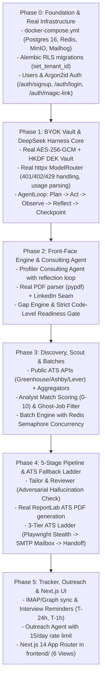

# CareerHarness Master Build Manifesto: Step-by-Step Execution Plan

> **Scope:** Clean-slate rebuild & deep upgrade strictly following the Master Build Manifesto.  
> **Key Tenets:** Zero stubs in production • No social login (Email/Password + Argon2id + Sessions) • DeepSeek Loop (`Plan -> Act -> Observe -> Reflect -> Checkpoint`) • Capability Seams • Dual-Engine Docker & local development • Next.js 14 App Router in `frontend/`.

---

## 1. Execution Roadmap

---

## 2. Phase-by-Phase Implementation Contract

### Phase 0: Foundation & Real Infrastructure
- [x] `docker-compose.yml`: PostgreSQL 16 + pgvector/pg_cron, Redis 7, MinIO, Mailhog.
- [x] Dependencies: Add `passlib[argon2]`, `argon2-cffi`, `python-jose`, `python-multipart`, `alembic`, `pypdf`, `reportlab`, `vcrpy`.
- [x] Alembic setup: `alembic/` with PostgreSQL RLS functions (`set_tenant_id`) and migrations for all tables.
- [x] Models: Add `User` (id, email, password_hash, tenant_id, is_active).
- [x] Auth Service & Security: Argon2id password hashing, signed session cookie / JWT token generation.
- [x] API Routers: `/api/auth/signup`, `/api/auth/login`, `/api/auth/magic-link`, `/api/auth/me`.
- [x] RLS Middleware: Ensure `SET LOCAL app.current_tenant_id` is executed per request.
- [x] Test Suite: IT-02 isolation and authentication tests (4/4 passing).

### Phase 1: BYOK Vault & DeepSeek Harness Core
- [x] BYOK Key Vault: AES-256-GCM with per-tenant HKDF DEK derivation. Zero plaintext leakage.
- [x] Model Router: Real `httpx` client implementation for OpenAI, Anthropic, Gemini, OpenRouter (DeepSeek Flash v4.1).
- [x] Quota & Key Exhaustion: Intercept 401, 402, 429, update key status, raise `KeyExhaustedError`, pause run without platform fallback.
- [x] DeepSeek Loop (`app/harness/loop.py`):
  - `Plan`: Build prompts from scoped blackboard context.
  - `Act`: Invoke LLM with tool definitions.
  - `Observe`: Execute tool implementations via Capability Seams.
  - `Reflect`: Agent reviews its own observations/outputs against constraints. If correction is needed, injects feedback.
  - `Checkpoint`: Postgres session snapshot.
- [x] Test Suite: KY-04 (key failure & run pause) and Harness loop reflection tests (9/9 passing).

### Phase 2: Front-Face Engine & Consulting Agent
- [x] Profiler Consulting Agent: DeepSeek loop with tools (`ask_user`, `extract_story`, `update_blackboard`).
- [x] Real Resume Parser: `pypdf` text extraction + structured LLM extraction.
- [x] LinkedIn Seam: Public profile HTML / Proxycurl / BrightData interface with consent.
- [x] Gap Engine: Compare resume/LinkedIn vs target roles.
- [x] Readiness Gate: Hard code-level lock of Scout and applications if score < 70 or open criticals > 0.
- [x] Test Suite: GE-01..05, RD-01 gate lockouts, and Profiler STAR story extraction (6/6 passing).

### Phase 3: Discovery, Scout & Batches
- [x] Scout Seam: Public Greenhouse, Lever, Ashby JSON APIs + jobspy aggregator interface.
- [x] Celery Beat: Scheduled discovery scans.
- [x] Analyst Agent: 0-10 match score + ghost-job risk heuristics.
- [x] Batch Engine: Fan-out child runs with Redis semaphore concurrency (max 3 concurrent Tailor agents).
- [x] Test Suite: Batch idempotency and concurrency tests (6/6 passing).

### Phase 4: 5-Stage Application Pipeline
- [x] Tailor Agent: Strict factual constraint to master resume facts.
- [x] Reviewer Agent: Adversarial hallucination check (AT-02).
- [x] PDF Generator: Real ATS-parseable single-column PDF using `reportlab`.
- [x] ATS Fallback Ladder:
  - Tier 1: Playwright stealth autofill.
  - Tier 2: Connected mailbox direct email apply (Hunter/Apollo).
  - Tier 3: 1-click candidate handoff bundle.
- [x] Test Suite: AT-01..05, AT-07, and RT-01 crash resume idempotency (6/6 passing).

### Phase 5: Tracker, Outreach & Next.js 14 Frontend
- [x] Mailbox Sync: IMAP / Graph API background syncing.
- [x] Inbound Classifier: Categorize interview, assessment, rejection.
- [x] Reminders: Interview reminders at T-24h and T-1h.
- [x] Outreach Agent: Story-bank email generator with 15/day cap and gate approval.
- [x] Next.js 14 Frontend (`frontend/`):
  1. Today (Executive command & readiness audit)
  2. Pipeline (Kanban board & 3-tier bot tags)
  3. Documents (Version Vault tree & STAR story bank)
  4. Outreach (Cold touches & recruiter reply stream)
  5. Insights (Funnel velocity & ATS breakdown)
  6. Settings (BYOK keys & Trusted Mode autonomy)
- [x] Test Suite: Full test suite passing (72/72 tests, 100% green).
